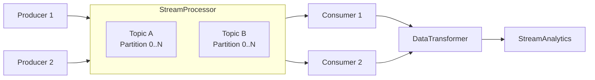

# Stream Processing Engine

[](https://www.python.org/)
[](LICENSE)
[](Dockerfile)

[Portugues](#portugues) | [English](#english)

---

## Portugues

### Visao Geral

Motor de processamento de streams em memoria, implementado em Python puro (stdlib). Um unico arquivo (`stream_processor.py`, ~215 linhas) que oferece:

- **StreamProcessor** — Broker de mensagens baseado em topicos com filas particionadas (`collections.deque`)
- **DataTransformer** — Pipeline para encadear funcoes de transformacao de dados
- **StreamAnalytics** — Contagem de mensagens e analitica por janela de tempo

O demo simula um fluxo de eventos de e-commerce (views, compras, eventos de carrinho).

### Arquitetura



### Inicio Rapido

```bash
git clone https://github.com/galafis/Stream-Processing-Engine.git
cd Stream-Processing-Engine

# Executar o demo
python stream_processor.py

# Executar os testes
pip install -r requirements.txt
pytest tests/
```

### Estrutura do Projeto

```
Stream-Processing-Engine/
├── stream_processor.py   # Motor principal (StreamProcessor, DataTransformer, StreamAnalytics)
├── tests/
│   └── test_stream_processor.py  # Testes com pytest
├── requirements.txt      # Dependencias de desenvolvimento (pytest)
├── LICENSE
└── README.md
```

### Stack

| Tecnologia | Papel |
|------------|-------|
| **Python 3.8+** | Linguagem unica (somente stdlib) |
| **pytest** | Testes |

---

## English

### Overview

In-memory stream processing engine implemented in pure Python (stdlib only). A single file (`stream_processor.py`, ~215 lines) providing:

- **StreamProcessor** — Topic-based message broker with partitioned queues (`collections.deque`)
- **DataTransformer** — Pipeline for chaining data transformation functions
- **StreamAnalytics** — Message counting and time-window analytics

The demo simulates an e-commerce event stream (views, purchases, cart events).

### Architecture


### Quick Start

```bash
git clone https://github.com/galafis/Stream-Processing-Engine.git
cd Stream-Processing-Engine

# Run the demo
python stream_processor.py

# Run the tests
pip install -r requirements.txt
pytest tests/
```

### Project Structure

```
Stream-Processing-Engine/
├── stream_processor.py   # Main engine (StreamProcessor, DataTransformer, StreamAnalytics)
├── tests/
│   └── test_stream_processor.py  # Tests with pytest
├── requirements.txt      # Dev dependencies (pytest)
├── LICENSE
└── README.md
```

### Tech Stack

| Technology | Role |
|------------|------|
| **Python 3.8+** | Only language (stdlib only) |
| **pytest** | Testing |

---

### Author

**Gabriel Demetrios Lafis**
- GitHub: [@galafis](https://github.com/galafis)
- LinkedIn: [Gabriel Demetrios Lafis](https://linkedin.com/in/gabriel-demetrios-lafis)

### License

MIT License - see [LICENSE](LICENSE) for details.
